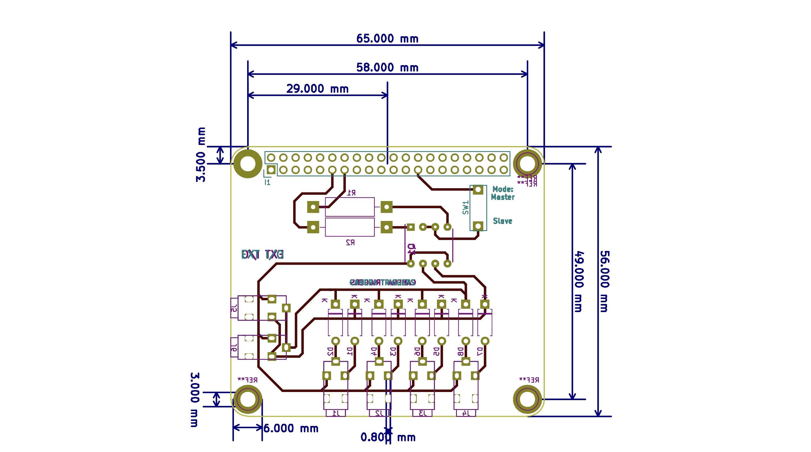

# Camera Synchronisation

Photogrammetry systems for capturing people require a huge

On this page, the hardware developed to synchronise the cameras is discussed. 

**Figure 1: An PCB Schematic for raspberry pi camera trigger**

