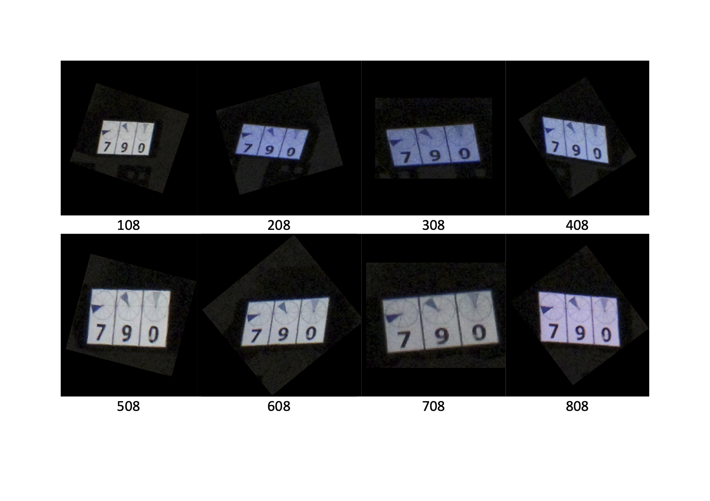

Photogrammetry systems designed to capture human subjects require precise camera shutter synchronisation to ensure all images are captured at the exact same time instance. 
This page details the process undertaken to develop a hardware based solution, in the form of a Raspberry Pi hat, to achieve precise synchronisation of multiple DSLR cameras.

## Camera Model
The [Canon EOS 1300d](https://www.canon.co.uk/for_home/product_finder/cameras/digital_slr/eos_1300d/) was selcted for this project as, at the time, it offered good price-to-resolution, external triggering options and software APIs to interface the camera.
While the [camera control software](camera-control.md) developed is agnostic to the camera hardware, the syncronisation hardware develop requires adaptation depending upon the external trigger interface of the DSLR camera. 
Generally, entry-level canon DSLR cameras use a 2.5mm audio jack for external triggering, which is a widely used interface in many consumer electronic devices. 

## Software Trigger
As a starting point, software based triggering via the USB was tested and found not be precise enough for this application. 
Triggering via USB introduced a variable delay between the first and last camera shutter, therefore software based triggering was not considered suitable for the intended application.  

## Circuit Development and PCB Fabrication

[TODO show image of circuit and describe]

The following components were identified for building the circuit and sourced from <a target="_blank" href="https://uk.rs-online.com/web/">RS</a>.

<b>Table 1: Component list with quantities per PCB and product links.</b>

| Component | Quantity per PCB | Link |
| ----------- | -------- | ----------- | 
| Diode (1N4148)	| 8 |<a target="_blank" href="https://uk.rs-online.com/web/p/switching-diodes/8431562">RS</a> |
| DIP Switch (SPST)| 1 |<a target="_blank" href="https://uk.rs-online.com/web/p/dip-sip-switches/8772154">RS</a> |
| GPIO Connector| 1| <a target="_blank" href="https://uk.rs-online.com/web/p/pcb-sockets/1731086">RS</a> |
| Headphone Jack (2.5mm)    | 6 | <a target="_blank" href="https://uk.rs-online.com/web/p/products/5051407/">RS</a> |
| IC Dip Socket (8-way) | 1 |<a target="_blank" href="https://uk.rs-online.com/web/p/dil-sockets/6742435">RS</a>|
| Opto Isolator (CNY74-2)	| 1 | <a target="_blank" href="https://uk.rs-online.com/web/p/optocouplers/1451599/">RS</a>|
| Resistor (1k) | 2 |<a target="_blank" href="https://uk.rs-online.com/web/p/through-hole-resistors/7077666">RS</a>|

The circuit design was reproduced in <a target="_blank" href="https://www.kicad.org/">KiCAD</a>, an open-source PCB design package. 
KiCAD provides useful functions such as auto routing allowing it to find an optional wire layout given positional contraints of components.
The design process required appropiate data that defined the footprint of each component. 
This was not avaliable for some components and therefore the footprint had to be created manually from the component datasheet using the KiCAD software. 

<b>Figure 1: PCB schematic for circuit on a raspberry pi hat form factor board</b>

A prototype of the design was fabricated with the help of the University of Surrey's Electronics Lab, who used a UV etching process to create a PCB, shown in Figure 1. 
After confirming that the prototype circuit operated as expected, I began the process of fabricating 16 of the boards for the full system. 

<b>Figure 2: Prototype PCB fabricated by the University Of Surrey Electronics Lab using UV etching</b>

The prototype fabrication process involved manually drilling component holes, which was not considered to be precise enough to ensure a high quality set of PCBs. 
For this reason, the manufacture of the final PCB boards was outsourced to a third party company.

<b>Figure 3: Fabricated PCB</b>

Each PCB was then soldered together in the University of Surrey's Electronics Lab using the componoents listed previously.

[TODO pic of final constructed board]

## Synchronisation Tests

[TODO - DESCRIBE SYNC TESTS]

<b>Figure 4: Images captured from different camera modules </b>

