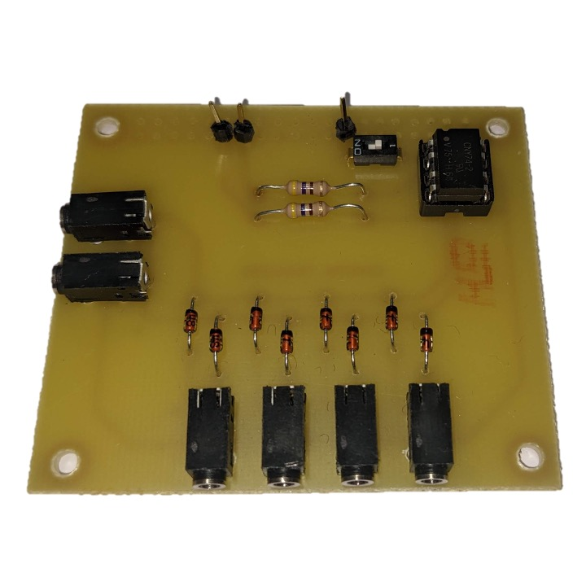
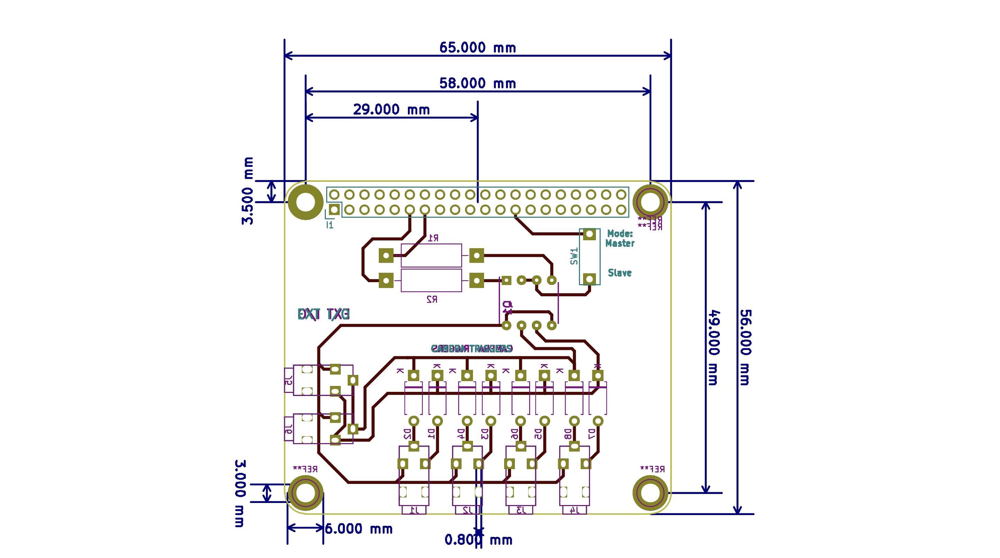
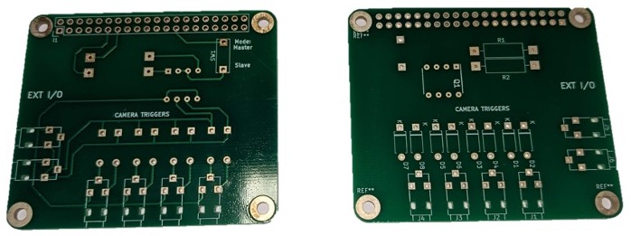

Photogrammetry systems for capturing people require precise synchronisation of the camera shutter to ensure all images at taken at the exact same time instance. 
This page details process of achieving precise the hardware that was developed to give precise synchronisation of cameras

## Camera Model
The [Canon 1300d](https://www.canon.co.uk/for_home/product_finder/cameras/digital_slr/eos_1300d/) was selected for this project driven by cost/resolution (at the time), hardware triggering options and available APIs to interface the hardware.  

## Software Trigger
As a starting point, software based triggering via the USB was tested and found to not be sufficient for this application. The decision was taken to develop a hardware based triggering system that could be integrated into a single unified paltform. 

## Hardware Trigger
[TODO]

## Circuit Development and Fabrication
In order to fabricate the camera synchronisation circuit 

A prototype was fabricated with the help of the University of Surrey's Electronics Lab, who used a UV etching of the initial design. After confirming that the circuit operated as expected, I began the process to created a PCB to be fabricated by machine. 

The circuit design was transfered to [KiCAD](https://www.kicad.org/), an open-source PCB design package, to create the files. This process required appropiate files that defined the 

[TODO ADD LIST OF COMPONOENTS]
| Component         | Link          |
| -----------       | -----------   | 
| Componenet 1      | [Link]()      |
| Componenet 2      | [Link]()      |

The initial PCB design is shown in Figure 1:  

<b>Figure 1: An PCB Schematic for raspberry pi camera trigger</b>

The final PCB design is shown in Figure 2, below:  

<b>Figure 2: An PCB Schematic for raspberry pi camera trigger</b>

The final fabricated PCB is shown in Figure 3

Each PCB was then constructued using the componoents, listed previously

## Synchronisation Tests

[TODO]

