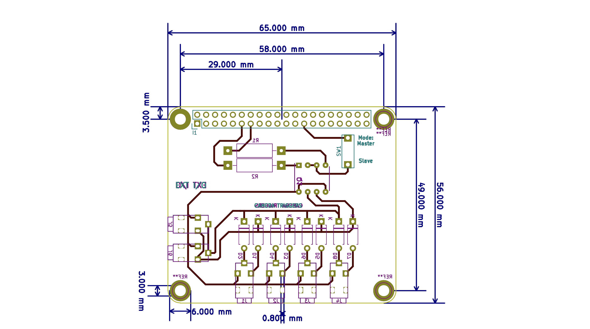
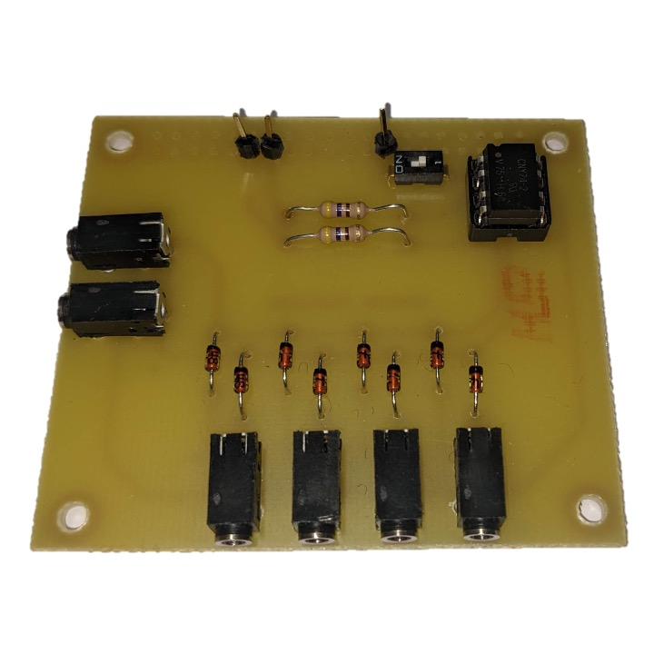
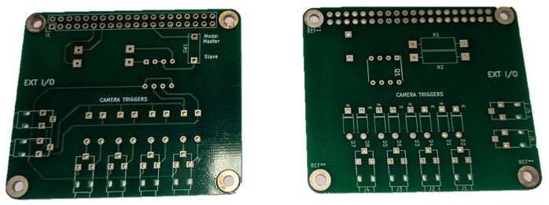
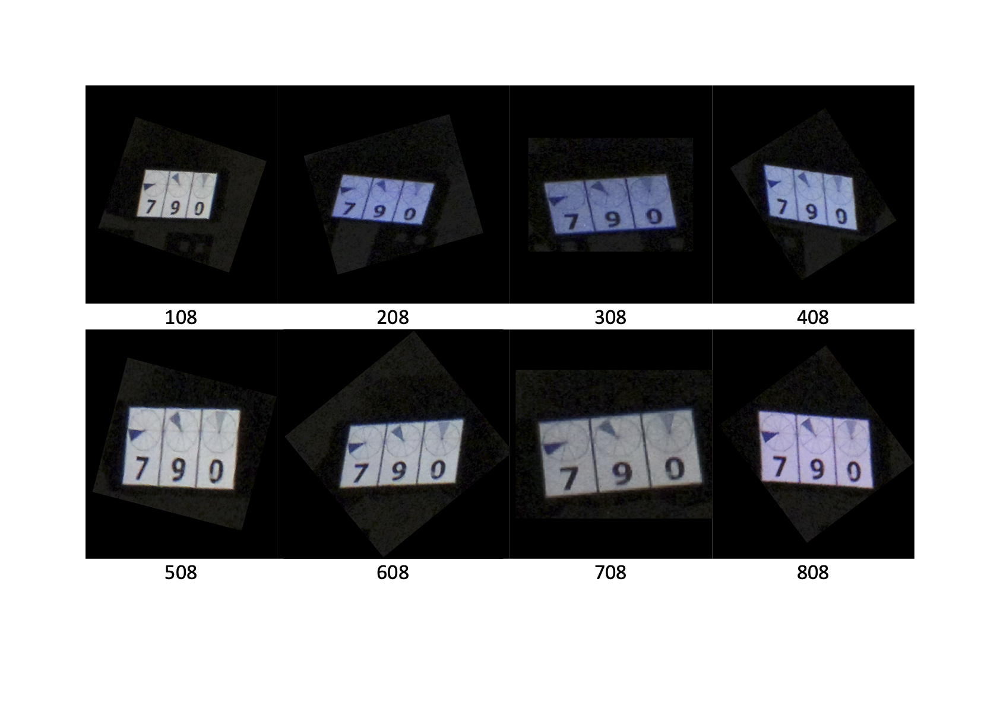

Photogrammetry systems designed to capture human subjects require precise shutter synchronisation so that all images represent the same instant. Even small timing differences can create reconstruction errors when the subject moves between frames.

This page describes the hardware-based synchronisation approach used by the system: a Raspberry Pi HAT that drives the external trigger inputs of multiple DSLR cameras.

## Camera Model

The [Canon EOS 1300D](https://www.canon.co.uk/for_home/product_finder/cameras/digital_slr/eos_1300d/) was selected because it offered a good balance of cost, resolution, external triggering support, and software control through libgphoto2.

The [camera control software](camera-control.md) is largely camera-model agnostic, provided the camera is supported by libgphoto2. The synchronisation hardware is more specific: it must match the camera's external trigger interface. Entry and mid-level Canon DSLR cameras commonly use a 2.5 mm jack for remote focus and shutter triggering.

## Software Trigger

Software triggering over USB was tested first. This approach was not precise enough for multi-camera human capture because it introduced variable delay between the first and last shutter event.

USB is still used for camera configuration and image transfer, but the capture signal is sent through the cameras' external trigger ports.

## Circuit Development and PCB Fabrication

The trigger board connects to the Raspberry Pi GPIO header and exposes multiple 2.5 mm trigger outputs for DSLR cameras. GPIO outputs from the Pi drive the trigger circuit, while opto-isolation helps separate the camera trigger lines from the Raspberry Pi electronics.

The following components were identified for building the circuit and sourced from <a target="_blank" href="https://uk.rs-online.com/web/">RS</a>.

<b>Table 1: Component list with quantities per PCB and product links.</b>

| Component | Quantity per PCB | Link |
| ----------- | -------- | ----------- | 
| Diode (1N4148)	| 8 |<a target="_blank" href="https://uk.rs-online.com/web/p/switching-diodes/8431562">RS</a> |
| DIP Switch (SPST)| 1 |<a target="_blank" href="https://uk.rs-online.com/web/p/dip-sip-switches/8772154">RS</a> |
| GPIO Connector| 1| <a target="_blank" href="https://uk.rs-online.com/web/p/pcb-sockets/1731086">RS</a> |
| Headphone Jack (2.5mm)    | 6 | <a target="_blank" href="https://uk.rs-online.com/web/p/products/5051407/">RS</a> |
| IC Dip Socket (8-way) | 1 |<a target="_blank" href="https://uk.rs-online.com/web/p/dil-sockets/6742435">RS</a>|
| Opto Isolator (CNY74-2)	| 1 | <a target="_blank" href="https://uk.rs-online.com/web/p/optocouplers/1451599/">RS</a>|
| Resistor (1k) | 2 |<a target="_blank" href="https://uk.rs-online.com/web/p/through-hole-resistors/7077666">RS</a>|

The circuit design was reproduced in <a target="_blank" href="https://www.kicad.org/">KiCad</a>, an open-source PCB design package.
KiCad was used to lay out the Raspberry Pi HAT form factor and route the trigger circuit. Some component footprints were not available in the default libraries, so custom footprints were created from the component datasheets.

<b>Figure 1:</b> PCB layout for the Raspberry Pi HAT trigger board.

A prototype of the design was fabricated with the help of the University of Surrey's Electronics Lab, who used a UV etching process to create a PCB.
After confirming that the prototype circuit operated as expected, I began the process of fabricating 16 of the boards for the full system. 

<b>Figure 2:</b> Prototype PCB fabricated by the University of Surrey Electronics Lab using UV etching.

The prototype fabrication process involved manually drilling component holes, which was not considered to be precise enough to ensure a high quality set of PCBs. 
For this reason, the manufacture of the final PCB boards was outsourced to a third party company.

<b>Figure 3:</b> Fabricated PCB.

Each PCB was then soldered together in the University of Surrey's Electronics Lab using the components listed previously.

## Synchronisation Tests

The synchronisation test captures the same moving event from multiple camera modules. If the trigger path is working correctly, the corresponding frames should show the event at the same point in time across cameras.
In figure 4, below, we see a croped image of an in-house synchronisation checker from 8 of the 16 camera modules. This demonstrates a high level of shutter synchronisation between independent cameras modules meaning a precise level of synchronisation, below 1/100th of a second, this is suitable for static human capture. 

This test is useful because it exercises the complete timing path:

- Network command broadcast from the control PC.
- Clock synchronisation between modules.
- Scheduled trigger timing on each Raspberry Pi.
- GPIO output through the trigger board.
- Camera response through the external trigger port.

<b>Figure 4:</b> Images captured from different camera modules during a synchronisation test.

