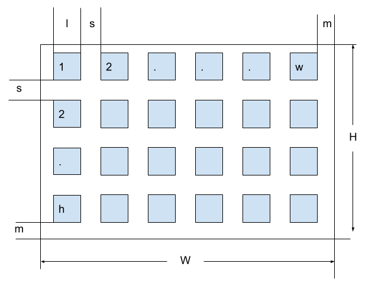
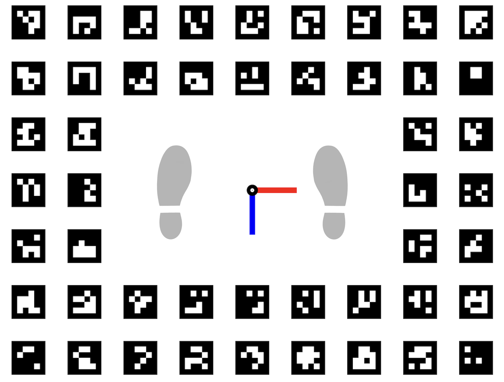

The processing pipeline utilises photogrammetry which will reconstruct the subject in an arbitary coordinate system (normally with the origin on one of the cameras in the solve) and at an arbitary scale. 
In order to recover metrically accurate scale and a useful origin (translation and orientation) a 


This was based on the <a href="https://docs.opencv.org/4.x/d5/dae/tutorial_aruco_detection.html" target="_blank">ArUco</a> library that ships as part of <a href="https://opencv.org/" target="_blank">OpenCV</a>.

```
example_aruco_create_board 
```


The following parameters control the creation of the board:

- d - dictionary: DICT\_4X4\_50=0, DICT\_4X4\_100=1, etc...
- w - Number of squares in X direction
- h - Number of squares in Y direction
- l - Marker side length (in pixels)
- s - Separation between two consecutive markers in the grid (in pixels)
- m - Margins size (in pixels)



<p style="text-align: center;"><b>Figure 1: Floor chart</b></p>

Given the parameters that control the drawing of the board and known structure, it is possible to formulate the width and height of the board in pixels as follows:

```math
W=2m+wl+(w-1)s
```
```math
H=2m+hl+(h-1)s
```

Making $s$ proportional to the size $l$ using variable $x$

```math
W=2m+wl+(w-1)xl
```
```math
H=2m+hl+(h-1)xl
```

Setting $W$ and $H$ to the size of A0 in pixels at 300 dpi removing the margin

```math
W_p = 1.189/0.0254*300 = 14043
```
```math
H_p = 0.841/0.0254*300 = 9933
```

```math
14043=wl+(w-1)xl
```
```math
9933=hl+(h-1)xl
```

The computed parameters can therefore be used to generate an A0 sized ArUco board at 300 DPI suitable for high-quality printing.  

```
./example_aruco_create_board -d=1 -w=9 -h=7 -m=0 -l=900 -s=585 floor-chart_7x5_a0.png
```

The generated image was then edited to remove the central portion of markers, and replaced with foot prints and arrows to represent the X-Z plane.  

The image below shows the final floor chart after editing 


<p style="text-align: center;"><b>Figure 1: Floor chart</b></p>
