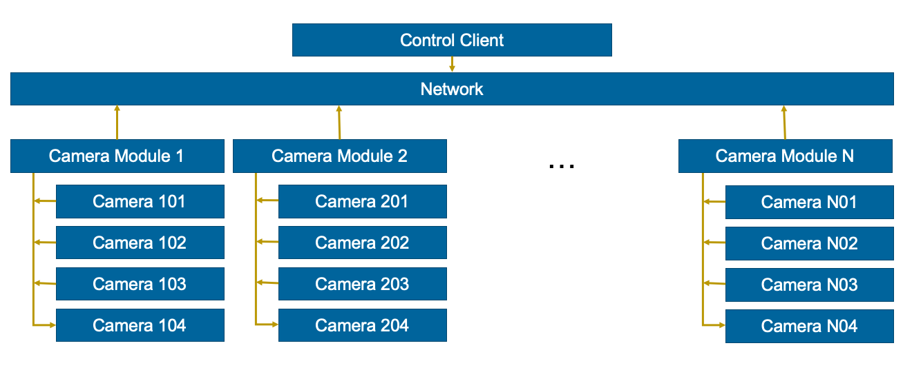

# DSLR-based Photogrammetry Capture System

## Introduction
This site will contain details of the construction of a DSLR-based photogrammetry system created at the University of Surrey

## System Architecture

The system is designed to be modular.

<i><b>Figure 1:</b> an overview of the system architecture</i>

