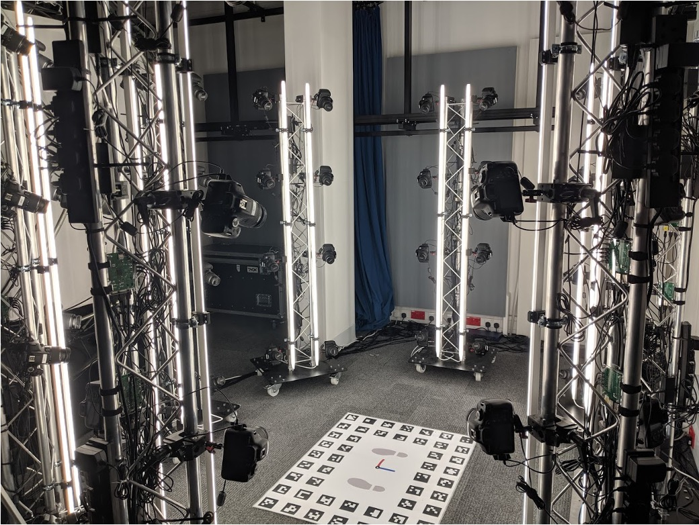

# Photogrammetry Capture System

**UNDER CONSTRUCTION**

## Overview
This site provides an overview of how a 64-camera photogrammetry system, shown in Figure 1, was built from scratch at the Universty of Surrey. 

<b>Figure 1:</b> Photogrammetry System

The following topics are discussed:

* **Hardware**
    - [System Overview](system-overview.md)
	- [Camera Synchronisation](camera-sync.md)
	- [Floor Chart](floor-chart.md)

* **Software**
  - [Client and Raspberry Pi Setup](system-setup.md)
  - [DSLR Camera Control](camera-control.md) 

