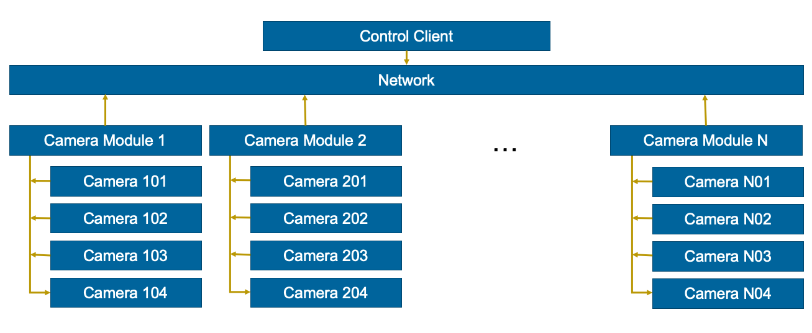

This page gives a high-level overview of the capture system architecture.

<b>Figure 1:</b> System Overview

The system consists of a central control PC and 16 camera modules connected over a local network. Each camera module is built around a [Raspberry Pi](https://www.raspberrypi.org/) and can support up to four DSLR cameras. Camera settings and image transfer are handled over USB, while autofocus and image capture is triggered through dedicated hardware so that all cameras fire at the same instant.

## Main Components

The control PC provides:

- A central operator interface for sending capture and configuration commands.
- A shared storage location for downloaded image data via FTP.
- A network time source so that Raspberry Pi modules can schedule captures from a common clock via NTP.

Each Raspberry Pi module provides:

- USB control for up to four DSLR cameras.
- A camera control server that listens for broadcast commands from the control PC.
- GPIO output for autofocus and shutter triggering through the custom trigger board.

Each DSLR camera provides:

- Image capture and local SD card storage.
- USB access for camera settings, card formatting, and image download.
- A 2.5 mm external trigger connection used by the synchronisation hardware.

## Capture Sequence

A typical capture follows this sequence:

1. The operator sends a command from the control PC.
2. The command is broadcast over UDP to the Raspberry Pi camera modules.
3. Each module schedules the capture using its local system clock.
4. At the trigger time, the module drives the GPIO trigger pin.
5. The custom trigger board closes the camera trigger circuit for each connected DSLR.
6. Captured images can then be downloaded from the cameras to the shared storage location.

The camera control software uses [libgphoto2](http://gphoto.org/) so that the control path is not tied to a single DSLR model, provided the camera is [supported by gphoto2](http://gphoto.org/proj/libgphoto2/support.php). The trigger hardware is camera-interface specific and was designed around DSLR bodies that expose focus and shutter control through a 2.5 mm remote trigger port.
