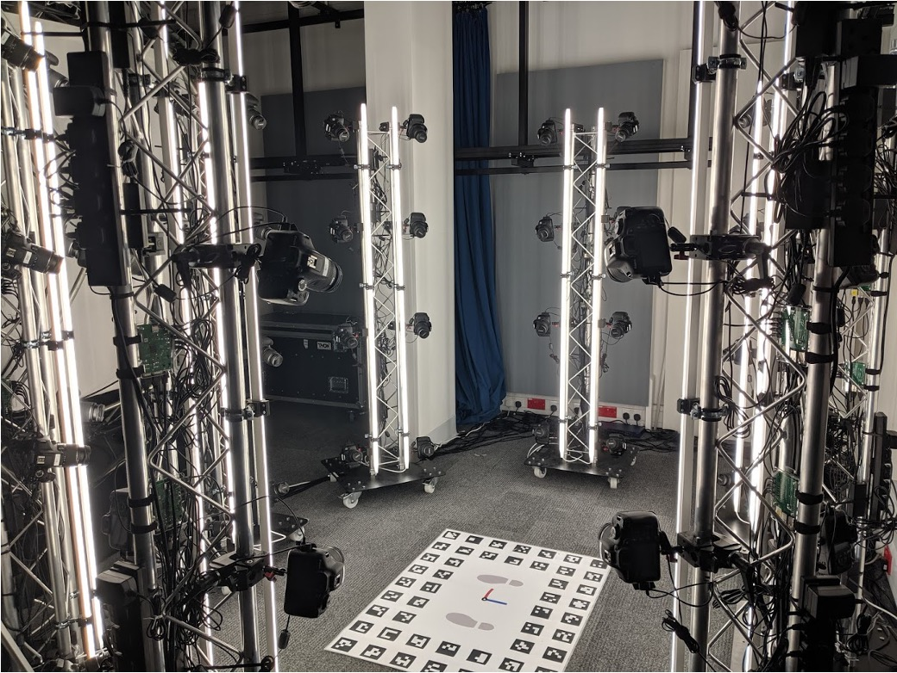

This page describes the main setup responsibilities for the control PC, Raspberry Pi camera modules, cameras, network, and capture area.

<b>Figure 1:</b> Photogrammetry System

## Physical Layout

The system is arranged around a central capture volume for a standing human subject. Cameras are mounted on towers around the subject so that the final image set contains views from different heights and angles.

The full system uses 16 Raspberry Pi camera modules. Each module can control up to four DSLR cameras, giving a maximum of 64 cameras. The system is modular and scalable and can support hundreds or even thousands of cameras. 

The capture volume should include:

- A clear subject position.
- Even lighting across the face, body, and clothing.
- Camera towers positioned to reduce occlusion.
- Cable routing that keeps USB, trigger, power, and network cables secure.
- The printed floor chart placed where it can be seen by enough cameras for scale and orientation recovery- see [Floor Chart ](/floor-chart) for more details.

## Control PC

The control PC is responsible for operating the capture system. It should provide:

- The camera control client application.
- A network connection to every Raspberry Pi module.
- A shared destination for downloaded images.
- A network time service so modules can maintain synchronized clocks.

The camera control configuration defines the broadcast address, UDP port, download directory, and optional Raspberry Pi host list used for hard reboot or shutdown operations.

## Raspberry Pi Modules

Each Raspberry Pi module should provide:

- USB connections to its local cameras.
- The camera control server application.
- The custom trigger board connected to the GPIO header.
- Network access to the control PC.
- System clock synchronization against the control PC or another local time source.

On startup, the server detects connected cameras through libgphoto2 and prepares the GPIO pins used for autofocus and shutter triggering.

## Cameras

Each DSLR camera should be configured consistently before capture:

- Manual exposure settings.
- Controlled autofocus behaviour.
- External trigger cable connected to the trigger board.
- USB connected to the Raspberry Pi module.
- SD card inserted and ready for storage.
- Set Owner Data meta data per camera to identify each device

The control software can set ISO, aperture, and shutter speed where those settings are supported by libgphoto2 for the camera model.

## Network

The camera modules and control PC communicate over a local network. The client sends UDP broadcast commands to all modules using the configured broadcast address and port.

For reliable operation:

- Keep all modules on the same subnet as the control PC.
- Confirm that UDP broadcast traffic is allowed on the selected network.
- Assign fixed Raspberry Pi addresses if hard shutdown or reboot commands are needed.
- Verify time synchronization before scheduled capture tests.

## Capture Checklist

Before a capture session:

1. Power on the control PC, network switch, Raspberry Pi modules, cameras, and lights.
2. Confirm that all modules are reachable on the network.
3. Start the camera control server on each Raspberry Pi module.
4. Start the camera control client on the control PC.
5. Detect cameras and confirm the expected number is reported.
6. Set exposure parameters.
7. Test autofocus and trigger behaviour.
8. Capture a small test set and download images.
9. Check image naming, exposure, sharpness, and coverage before full capture.
